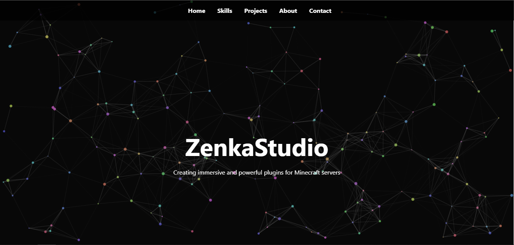

# ZenkaStudio Portfolio

[](https://playzenka.github.io/my-website/)

Welcome to the **portfolio of ZenkaStudio**, a Minecraft plugin developer. This site showcases my projects, skills, and ways to get in touch with me.

---

## 🖥️ Demo

Live demo: [https://playzenka.github.io/my-website/](https://playzenka.github.io/my-website/)



---

## 📂 Project Structure

├─ index.html # Main HTML file
├─ style.css # CSS styles
├─ animation.js # Canvas background animation
├─ favicon.ico # Website favicon
└─ README.md # This file


---

## ✨ Features

- Smooth **background particle animation** with connecting lines
- Responsive **navigation menu** that hides/shows on scroll
- **Typewriter effect** for main phrase
- Section-based **scroll animations**
- Detailed **Skills, Projects, About, Contact** sections
- Mobile-friendly layout with **flexbox** and responsive design
- Ready to deploy on **GitHub Pages**

---

## 🛠️ Skills Highlighted on the Site

- **Languages:** Java, Kotlin, JavaScript, HTML/CSS
- **Game Development:** Paper / Spigot API, PlaceholderAPI, WorldEdit Integration, Custom Enchantments
- **Tools:** Git/GitHub, IntelliJ IDEA, Figma, Photoshop

---

## 🚀 How to Run Locally

1. Clone this repository:

```bash
git clone https://github.com/your-github-username/zenkastudio-portfolio.git
```

2. Open **index.html** in your favorite browser.
No additional dependencies or build tools are required.

---

## 📬 Contact

**Discord:** @PlayZenka

**Email:** russ.m.010505@gmail.com

--- 
## ⚡ Deployment
This site is static and fully compatible with GitHub Pages.
Just push your files to the repository and enable GitHub Pages in the repository settings

--- 
## 📝 License
This project is open for personal portfolio use.
© 2025 ZenkaStudio

